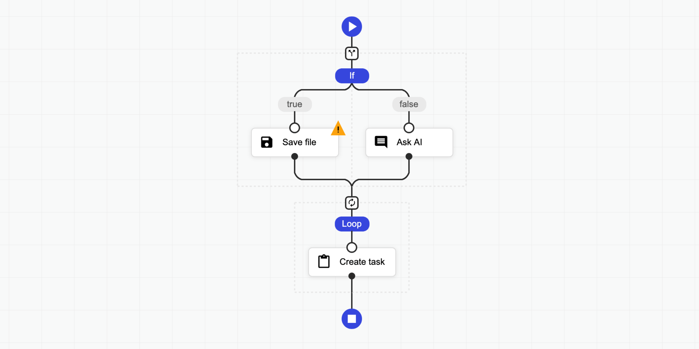

# Sequential Workflow Designer

[](https://actions-badge.atrox.dev/b4rtaz/sequential-workflow-designer/goto?ref=main) [](/LICENSE) [](https://npmjs.org/package/sequential-workflow-designer)

Sequential workflow designer with 0 external dependencies for web applications. It's written in pure TypeScript and uses SVG for rendering. This designer is not associated with any workflow engine. It's full generic. You may create any kind application by this, from graphical programming languages to workflow builders.

Features:

* 0 external dependencies,
* fully generic and configurable,
* use light/dark themes or customize easily,
* compatible with modern browsers and mobile devices,
* the definition is stored as JSON,
* supports [Angular](./angular/designer/), [React](./react/) and [Svelte](./svelte/).

📝 Check the [documentation](https://nocode-js.com/docs/category/sequential-workflow-designer) for more details.

🤩 Don't miss [the pro version](https://nocode-js.com/sequential-workflow-designer-pro-pricing).

## 👀 Examples

* [⏩ Live Testing](https://nocode-js.github.io/sequential-workflow-designer/examples/live-testing.html)
* [💥 Triggers](https://nocode-js.github.io/sequential-workflow-designer/examples/triggers.html)
* [❎ Fullscreen](https://nocode-js.github.io/sequential-workflow-designer/examples/fullscreen.html)
* [🌅 Image Filter](https://nocode-js.github.io/sequential-workflow-designer/examples/image-filter.html)
* [🔴 Particles](https://nocode-js.github.io/sequential-workflow-designer/examples/particles.html)
* [🌍 Internationalization](https://nocode-js.github.io/sequential-workflow-designer/examples/i18n.html)
* [⛅ Light Dark](https://nocode-js.github.io/sequential-workflow-designer/examples/light-dark.html)
* [🤖 Code Generator](https://nocode-js.github.io/sequential-workflow-designer/examples/code-generator.html)
* [🌻 Rendering Test](https://nocode-js.github.io/sequential-workflow-designer/examples/rendering-test.html)
* [🚄 Stress Test](https://nocode-js.github.io/sequential-workflow-designer/examples/stress-test.html)
* [🚪 Editing Restrictions](https://nocode-js.github.io/sequential-workflow-designer/examples/editing-restrictions.html)
* [📜 Scrollable Page](https://nocode-js.github.io/sequential-workflow-designer/examples/scrollable-page.html)
* [🌵 Multi-Conditional Switch](https://nocode-js.github.io/sequential-workflow-designer/examples/multi-conditional-switch.html)
* [🌀 Auto-Select](https://nocode-js.github.io/sequential-workflow-designer/examples/auto-select.html)
* [Angular Demo](https://nocode-js.github.io/sequential-workflow-designer/angular-app/)
* [React Demo](https://nocode-js.github.io/sequential-workflow-designer/react-app/)
* [Svelte Demo](https://nocode-js.github.io/sequential-workflow-designer/svelte-app/)

Pro:

* [🤩 Pro Components](https://nocode-js.com/examples/sequential-workflow-designer-pro/webpack-pro-app/public/pro-components.html)
* [🍬 Custom Theme Flat](https://nocode-js.com/examples/sequential-workflow-designer-pro/webpack-pro-app/public/custom-theme-flat.html)
* [🌹 Custom Step Types](https://nocode-js.com/examples/sequential-workflow-designer-pro/webpack-pro-app/public/custom-step-types.html)
* [📺 Popup Editor](https://nocode-js.com/examples/sequential-workflow-designer-pro/webpack-pro-app/public/popup-editor.html)
* [🔽 Collapsible Region](https://nocode-js.com/examples/sequential-workflow-designer-pro/webpack-pro-app/public/collapsible-region.html)
* [💼 Copy Paste](https://nocode-js.com/examples/sequential-workflow-designer-pro/webpack-pro-app/public/copy-paste.html)
* [👈 Goto](https://nocode-js.com/examples/sequential-workflow-designer-pro/webpack-pro-app/public/goto.html)
* [📁 Folders](https://nocode-js.com/examples/sequential-workflow-designer-pro/webpack-pro-app/public/folders.html)
* [⭕ Wheel Mode](https://nocode-js.com/examples/sequential-workflow-designer-pro/webpack-pro-app/public/wheel-mode.html)
* [💠 Grid](https://nocode-js.com/examples/sequential-workflow-designer-pro/webpack-pro-app/public/grid.html)
* [🐭 Minimal Root Component](https://nocode-js.com/examples/sequential-workflow-designer-pro/webpack-pro-app/public/minimal-root-component.html)
* [🦁 External UI Components](https://nocode-js.com/examples/sequential-workflow-designer-pro/webpack-pro-app/public/external-ui-components.html)
* [👋 Custom Dragged Component](https://nocode-js.com/examples/sequential-workflow-designer-pro/webpack-pro-app/public/custom-dragged-component.html)
* [🔰 Badges](https://nocode-js.com/examples/sequential-workflow-designer-pro/webpack-pro-app/public/badges.html)
* [🎩 Custom Viewport](https://nocode-js.com/examples/sequential-workflow-designer-pro/webpack-pro-app/public/custom-viewport.html)
* [👊 Double Click](https://nocode-js.com/examples/sequential-workflow-designer-pro/webpack-pro-app/public/double-click.html)
* [🛎 Clickable Placeholder](https://nocode-js.com/examples/sequential-workflow-designer-pro/webpack-pro-app/public/clickable-placeholder.html)
* [📮 Conditional Placeholders](https://nocode-js.com/examples/sequential-workflow-designer-pro/webpack-pro-app/public/conditional-placeholders.html)
* [React Pro Demo](https://nocode-js.com/examples/sequential-workflow-designer-pro/react-pro-app/build/index.html)
* [Angular Pro Demo](https://nocode-js.com/examples/sequential-workflow-designer-pro/angular-pro-app/angular-app/index.html)

## 👩‍💻 Integrations

* [⛽ Sequential Workflow Editor](https://github.com/nocode-js/sequential-workflow-editor) - Powerful step editor builder. Don't write step editors manually, build them.
* [🚚 Sequential Workflow Machine](https://github.com/nocode-js/sequential-workflow-machine) - Workflow engine for browser and NodeJS apps, powered by the xstate library.

## 🚀 Installation

To use the designer you should add JS/TS files and CSS files to your project.

### NPM

Install this package by [NPM](https://www.npmjs.com/) command:

`npm i sequential-workflow-designer`

To import the package:

```ts
import { Designer } from 'sequential-workflow-designer';
```

If you use [css-loader](https://webpack.js.org/loaders/css-loader/) or similar, you can add CSS files to your bundle:

```ts
import 'sequential-workflow-designer/css/designer.css';
import 'sequential-workflow-designer/css/designer-light.css';
import 'sequential-workflow-designer/css/designer-soft.css';
import 'sequential-workflow-designer/css/designer-dark.css';
```

To create the designer write the below code:

```ts
// ...
Designer.create(placeholder, definition, configuration);
```

### CDN

Add the below code to your head section in HTML document.

```html
<head>
...
<link href="https://cdn.jsdelivr.net/npm/sequential-workflow-designer@0.34.1/css/designer.css" rel="stylesheet">
<link href="https://cdn.jsdelivr.net/npm/sequential-workflow-designer@0.34.1/css/designer-light.css" rel="stylesheet">
<link href="https://cdn.jsdelivr.net/npm/sequential-workflow-designer@0.34.1/css/designer-dark.css" rel="stylesheet">
<script src="https://cdn.jsdelivr.net/npm/sequential-workflow-designer@0.34.1/dist/index.umd.js"></script>
```

Call the designer by:

```js
sequentialWorkflowDesigner.Designer.create(placeholder, definition, configuration);
```

## 🎬 Usage

Check [examples](/examples) directory.

```ts
import { Designer } from 'sequential-workflow-designer';

const placeholder = document.getElementById('placeholder');

const definition = {
  properties: {
    'myProperty': 'my-value',
    // root properties...
  },
  sequence: [
    // steps...
  ]
};

const configuration = {
  theme: 'light', // optional, default: 'light'
  isReadonly: false, // optional, default: false
  undoStackSize: 10, // optional, default: 0 - disabled, 1+ - enabled

  steps: {
    // all properties in this section are optional

    iconUrlProvider: (componentType, type) => {
      return `icon-${componentType}-${type}.svg`;
    },

    isDraggable: (step, parentSequence) => {
      return step.name !== 'y';
    },
    isDeletable: (step, parentSequence) => {
      return step.properties['isDeletable'];
    },
    isDuplicable: (step, parentSequence) => {
        return true;
    },
    canInsertStep: (step, targetSequence, targetIndex) => {
      return targetSequence.length < 5;
    },
    canMoveStep: (sourceSequence, step, targetSequence, targetIndex) => {
      return !step.properties['isLocked'];
    },
    canDeleteStep: (step, parentSequence) => {
      return step.name !== 'x';
    }
  },

  validator: {
    // all validators are optional

    step: (step, parentSequence, definition) => {
      return /^[a-z]+$/.test(step.name);
    },
    root: (definition) => {
      return definition.properties['memory'] > 256;
    }
  },

  toolbox: {
    isCollapsed: false,
    groups: [
      {
        name: 'Files',
        steps: [
          // steps for the toolbox's group
        ]
      },
      {
        name: 'Notification',
        steps: [
          // steps for the toolbox's group
        ]
      }
    ]
  },

  editors: {
    isCollapsed: false,
    rootEditorProvider: (definition, rootContext, isReadonly) => {
      const editor = document.createElement('div');
      // ...
      return editor;
    },
    stepEditorProvider: (step, stepContext, definition, isReadonly) => {
      const editor = document.createElement('div');
      // ...
      return editor;
    }
  },

  controlBar: true,
  contextMenu: true,
};

const designer = Designer.create(placeholder, definition, configuration);
designer.onDefinitionChanged.subscribe((newDefinition) => {
  // ...
});
```

You can hide default UI components by setting the corresponding configuration property to `false`.

```ts
const configuration = {
  toolbox: false,
  editors: false,
  controlBar: false,
  contextMenu: false,
  // ...
}
```

## 💡 License

This project is released under the MIT license.
